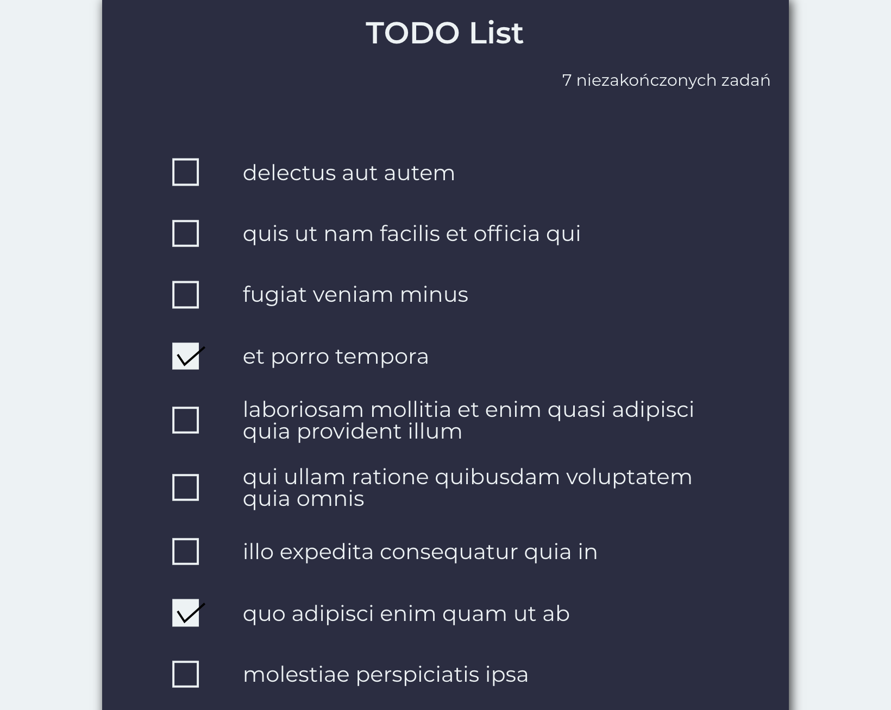

Lista zadań zrobiona za pomocą [Create React App](https://github.com/facebook/create-react-app), [React](https://reactjs.org), [Redux](https://redux.js.org), [Redux-Saga](https://redux-saga.js.org), [Styled Components](https://www.styled-components.com), [React Toastify](https://fkhadra.github.io/react-toastify/), [Axios](https://github.com/axios/axios).



## O aplikacji

Aplikacja używa endpointu `/todos` wystawianego przez https://jsonplaceholder.typicode.com

Aplikacja:
* Wyświetla maksymalnie 10 zadań
* Umożliwia zmianę statusu zadania: zrobione / do zrobienia
* Dodanie nowego zadania do listy (jeżeli na liście jest mniej niż 10 zadań)
* Usunięcie wykonanych zadań

## Znane błędy

1. Po dodaniu więcej niż jednego zadania występuje błąd powtórzonego pola `key` w liście zadań. Wynika to ze zwracanego id przez endpoint, który jest zawsze taki sam. Nie przeszkadza to w dodawaniu kolejnych zadań.
2. Brak możliwości zmiany statusu ręcznie dodanego zadania na wykonane. Wynika to z faktu, że id zadania które jest zwracane z endpointu tworzącego zadanie zwraca błąd 404 podczas próby edycji.

## Uruchomienie aplikacji

W celu uruchomienia aplikacji w trybie deweloperskim należy uruchomić następujące polecenia:

```
npm install
npm start
```
